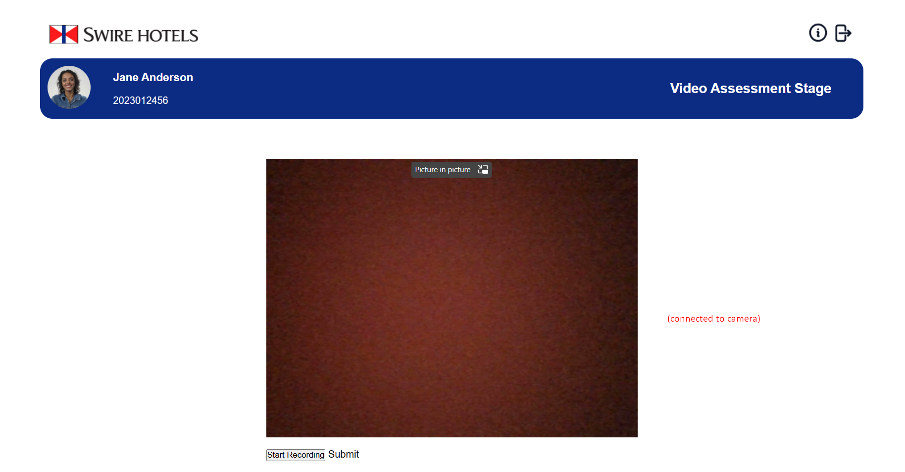
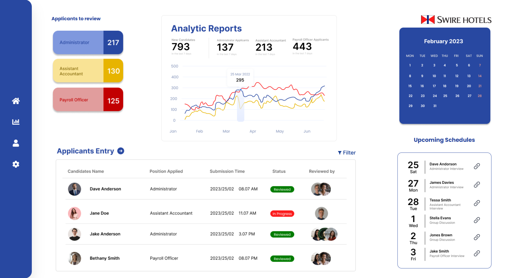

 # CTech Automated Job Interview System 
This is a prototype that me and my other teammates worked on for the Swire Hackathon 2023 in less than 1 week.
The idea of the project is to create a platform for an automated interview.   
Although the project is not 100% finished, the main components of what we are making are already here and the big idea can be grasped.  

The project consists of three main parts:
1. Applicant view: This is the applicant's interface and throughout  the interview, the applicant's camera and microphone will be turned on and they will start talking to the chatbot.  

2. HR manager's view: This is where HR can see the recording transcript of the applicant's interview with the chatbot. To view this, go to Applicant's list --> data icon of Jane Anderson. 

3. System: This is the heart of the project, where inside of it is our trained chatbot. We have finished this however some API keys are needed to try it out. If you are interested on trying this prototype out, please feel free to contact me at aldenchristian.business@gmail.com
